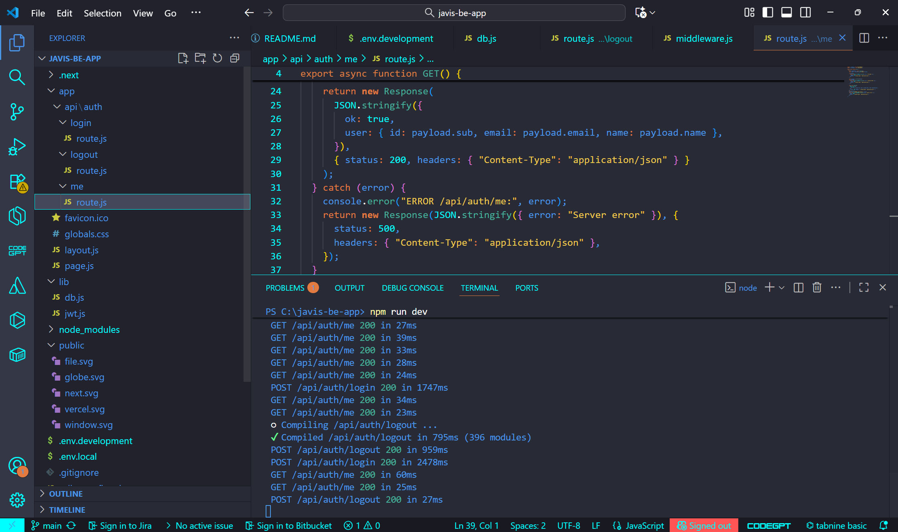

This is a [Next.js](https://nextjs.org) project bootstrapped with [`create-next-app`](https://github.com/vercel/next.js/tree/canary/packages/create-next-app).

## Getting Started

First, run the development server:


```bash
npm run dev
# or
yarn dev
# or
pnpm dev
# or
bun dev
```

Open [http://localhost:3000](http://localhost:3000) with your browser to see the result.

You can start editing the page by modifying `app/page.js`. The page auto-updates as you edit the file.

This project uses [`next/font`](https://nextjs.org/docs/app/building-your-application/optimizing/fonts) to automatically optimize and load [Geist](https://vercel.com/font), a new font family for Vercel.

## Learn More

To learn more about Next.js, take a look at the following resources:

- [Next.js Documentation](https://nextjs.org/docs) - learn about Next.js features and API.
- [Learn Next.js](https://nextjs.org/learn) - an interactive Next.js tutorial.

You can check out [the Next.js GitHub repository](https://github.com/vercel/next.js) - your feedback and contributions are welcome!

## Deploy on Vercel

The easiest way to deploy your Next.js app is to use the [Vercel Platform](https://vercel.com/new?utm_medium=default-template&filter=next.js&utm_source=create-next-app&utm_campaign=create-next-app-readme) from the creators of Next.js.

Check out our [Next.js deployment documentation](https://nextjs.org/docs/app/building-your-application/deploying) for more details.
## Deskripsi
Backend untuk TailAdmin menggunakan **Next.js API Routes**, mengelola autentikasi, JWT, dan koneksi ke PostgreSQL.

---

## Tech Stack
- **Backend:** Next.js API Routes (Node.js)
- **Database:** PostgreSQL (schema `javis`)  
- **Authentication:** JWT (JSON Web Token)
- **Hashing Password:** bcryptjs
- **UUID:** uuid (untuk JWT jti)

---
## Struktur Proyek

****
```bash
app/
└─ api/
└─ auth/
├─ login/route.js
├─ logout/route.js
└─ me/route.js
lib/
├─ db.js # PostgreSQL connection
└─ jwt.js # JWT helpers
.env.local # environment variables
```

---

## Setup

 **Install dependencies**
```bash
npm install

#env.local
# PostgreSQL lokal
PG_HOST=localhost
PG_PORT=5432
PG_USER=postgres
PG_PASSWORD=12345
PG_DATABASE=postgres

# JWT
JWT_SECRET=de930518ffa5405a8ee158e8270ec396
JWT_EXPIRES_IN=1h

# Environment
NODE_ENV=development

#DATABASE
SELECT datname FROM pg_database WHERE datistemplate = false;


CREATE TABLE "javis".users (
  id SERIAL PRIMARY KEY,
  email VARCHAR(255) NOT NULL UNIQUE,
  password_hash VARCHAR(255) NOT NULL,
  name VARCHAR(255),
  created_at TIMESTAMP DEFAULT now()
);


INSERT INTO javis.users (email, password_hash, name)
VALUES ('test@example.com', '$2a$12$nnrpmLf2Fkdw.U9M8S272uj2s.QV9lqPId6sZsIloahmu0bEi7xnS', 'Test User');


```
